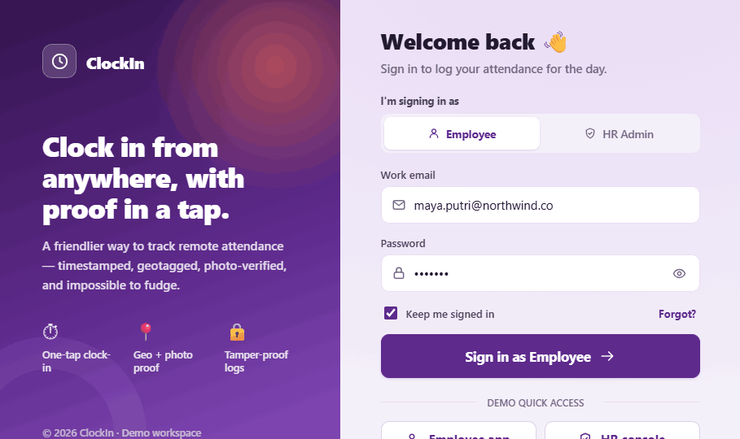
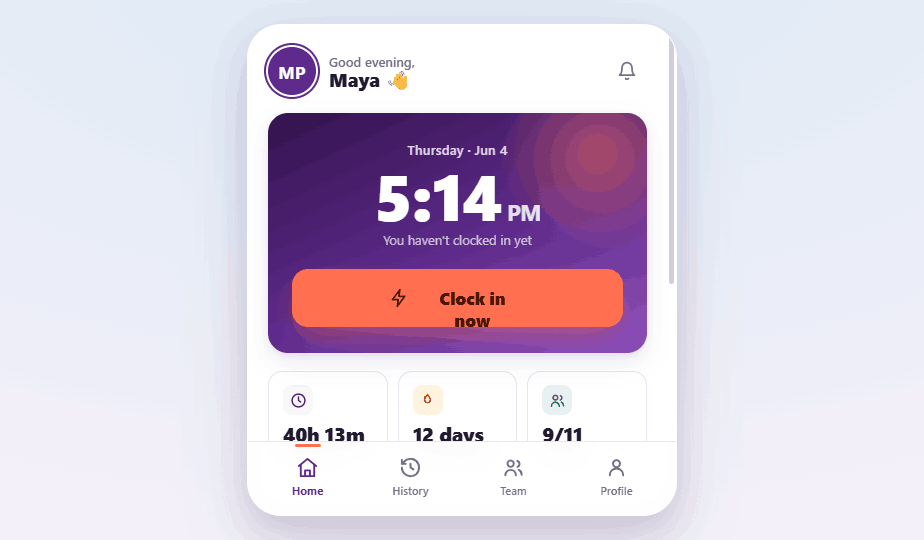
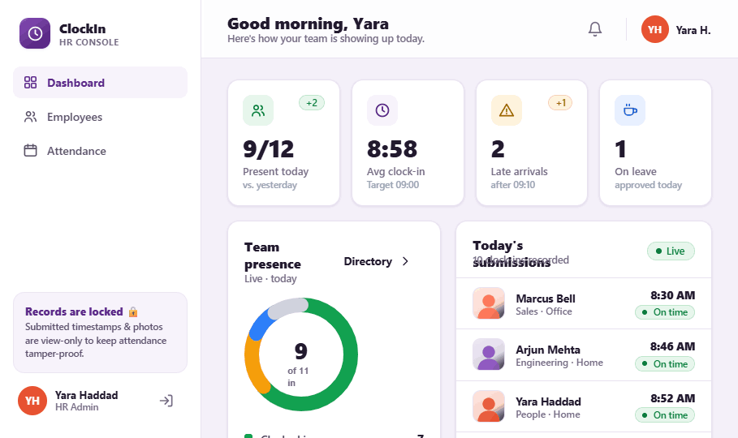

# Handoff: ClockIn — Employee WFH Attendance App

> ## 📋 Implementation audit (June 2026 — repo `fadhil30/clockin`)
> The app has been partially built. A full code review found it's a **functional MVP**
> but a **low-fidelity** build of this design. Fixes are specified in **`FIX_HANDOFF.md`**;
> a ready-to-paste agent prompt is in **`CLAUDE_CODE_PROMPT.md`**. Headlines:
>
> **Backend** — Stack matches (NestJS modular monolith, MySQL/TypeORM, Supabase storage, JWT).
> The immutability rule is **mostly** enforced (no edit/delete routes on attendance) but has
> a real hole: **photo re-upload isn't blocked**, and there's **no DB-level write-once
> protection**. Also: hardcoded JWT fallback secret, and the schema is **missing `work mode`
> + late status** and most employee-profile fields.
>
> **Frontend** — Running on **stock Tailwind blue, not the ClockIn brand tokens**; the **employee app is a
> desktop sidebar, not the mobile phone-shell**; Login is a plain card (no split/role
> segmented/demo); ClockHero, the clock-in Success step, live camera, and the
> **History / Team / Profile** screens are missing; admin dashboard/attendance are minimal.
> No `@tanstack/react-query` (manual fetching).
>
> See `FIX_HANDOFF.md` for the prioritized fix list (P0 security/immutability → P1 data model
> → P2 UI), exact file paths, current-vs-target code, new-endpoint specs (Appendix A), and the
> data-model reconciliation note (Appendix B).

## Overview
**ClockIn** is a remote-work attendance system with two connected applications sharing one design language and backend:

1. **Employee app** (mobile-first, responsive) — log in, clock in/out, capture a live timestamp + geolocation, upload/take a photo proof, review and confirm. Plus attendance history (list + calendar) and a team-presence view.
2. **HR Admin console** (desktop) — manage employee master data (CRUD), and monitor attendance logs in a **strictly view-only** way (HR can never alter a submitted timestamp or photo).

This bundle is the **design reference + full technical brief** for implementing ClockIn as a real fullstack product in the target stack below.

---

## Design preview (current prototype — "Plum & Coral" brand)
Rendered screens of the target design, in `screens/`:

| Login | Employee Home | HR Admin |
|---|---|---|
|  |  |  |

- **Login** — split brand panel (plum gradient) + form with role segmented control, show/hide password, demo quick-access.
- **Employee Home** — mobile phone-shell, Spotlight ClockHero (plum gradient + coral "Clock in now" CTA, Space Grotesk live clock), quick stats, bottom tab bar.
- **HR Admin** — desktop console, 4 KPI cards + team-presence donut + today's submissions feed, "Records are locked 🔒" reassurance card. View-only.

---

## ⚠️ About the Design Files
The `.html` / `.jsx` files in this bundle are **design references created in HTML** — interactive prototypes showing the intended look, layout, and behavior. **They are not production code to copy directly.**

Your task is to **recreate these designs in the production stack** (React.js + Vite frontend, NestJS backend, MySQL), using proper project structure, real API calls, and real state — not to ship the prototype HTML. The HTML is the source of truth for **UI, copy, flows, and visual tokens**; this README + companion docs are the source of truth for **architecture, data model, and APIs**.

The prototype uses inline React (Babel in the browser) and mock data. In production: split into real components/modules, replace mock data with API calls, and follow the structure in `ARCHITECTURE.md`.

---

## Fidelity
**High-fidelity (hifi).** Colors, typography, spacing, radii, shadows, and interactions are final. Recreate the UI faithfully using these exact design tokens (see "Design Tokens" below). Animations and micro-interactions are part of the spec.

---

## Target Stack (confirmed with stakeholder)
| Layer | Choice | Notes |
|---|---|---|
| Backend language | **TypeScript** | |
| Backend framework | **NestJS** | Microservices architecture (gateway + domain services) |
| Database | **MySQL** | Built via TypeORM so it is **Oracle-swappable later** (Oracle is the preferred long-term target) |
| Frontend framework | **React.js** (SPA) | **Not Next.js** — plain React |
| Frontend build tool | **Vite** | `react-ts` template |
| Routing | `react-router-dom` | |
| Data fetching | `axios` + `@tanstack/react-query` | |
| Auth | **JWT** with role claim (`employee` / `hr_admin`) | |
| Photo storage | Object storage (S3-compatible / MinIO) or local volume in dev | DB stores the URL, not the blob |

> See **`ARCHITECTURE.md`** for the microservices breakdown, **`DATA_MODEL.md`** for the MySQL schema, **`API_SPEC.md`** for endpoints, and **`FRONTEND.md`** for the screen-by-screen component spec.

---

## Companion documents in this bundle
| File | What it covers |
|---|---|
| `README.md` | This file — overview, fidelity, tokens, index, implementation audit |
| **`FIX_HANDOFF.md`** | **★ The remediation plan — exact backend + frontend fixes (P0→P1→P2), file paths, current-vs-target code, new-endpoint implementations (Appendix A), data-model decision (Appendix B). This is the binding source of truth for the build.** |
| **`CLAUDE_CODE_PROMPT.md`** | **★ Ready-to-paste master prompt for Claude Code that executes `FIX_HANDOFF.md`.** |
| `FRONTEND.md` | Every screen: layout, components, states, copy (visual source of truth) |
| `API_SPEC.md` | Canonical as-built API at top; aspirational spec below (reference) |
| `DATA_MODEL.md` | Immutability trigger + field reference (aspirational normalized schema — not the build target) |
| `ARCHITECTURE.md` | Frontend layout + patterns (aspirational microservices topology — not the build target) |
| `prototype/` | The HTML/JSX design reference (open `index.html` in a browser) |

> **Reading order for the implementer:** `README.md` (tokens + audit) → **`FIX_HANDOFF.md`** (what to change) → `FRONTEND.md` (how screens should look) → `API_SPEC.md` canonical section. `DATA_MODEL.md` / `ARCHITECTURE.md` are reference only; where they conflict with `FIX_HANDOFF.md`, **`FIX_HANDOFF.md` wins.**

---

## Design Tokens (exact)

> **ClockIn is its own brand — "Plum & Coral".** It is *not* affiliated with any external
> design system. Aubergine plum reads as calm, trustworthy and ownable (not generic
> corporate blue); coral is the warm "moment of arrival" energy reserved for the primary
> clock-in action. Green is reserved strictly for verified/present status.

### Colors
```
/* Brand (Aubergine Plum) */
--brand-50:#F7F3FB;  --brand-100:#EEE3F6; --brand-200:#DCC7EC; --brand-300:#C2A1DC;
--brand-400:#A273C6; --brand-500:#8348A9; --brand-600:#6A3290; --brand-700:#4A1D6E;

--primary:            #5E2A8C;   /* plum — primary actions, brand */
--primary-foreground: #FFFFFF;

/* Accent (tweakable; default Coral). The prototype lets a user switch accent —
   in production, pick ONE. Default = Coral. */
--accent:            #FF6F50;
--accent-strong:     #E8512F;
--accent-soft:       #FFEDE8;
--accent-foreground: #4A1606;

/* Status */
--success:#12A150;  --warning:#F59E0B;  --info:#2D7FF9;  --destructive:#E5484D;

/* Neutrals (warm, plum-tinted) */
--background:#FFFFFF;
--foreground:#221A2E;
--muted:#F5F2F9;
--muted-foreground:#736B82;
--border:#E9E2F1;
--card:#FFFFFF;
--app-bg:#F4F0F9;                    /* page background behind cards/phone shell */
```

Alternate accent palettes offered in the prototype (pick one or expose as a theme setting):
`Coral #FF6F50` · `Green #12A150` · `Amber #F59E0B` · `Blue #2D7FF9` · `Violet #9A4DD6`.

### Status pill tones (bg / text / border)
```
success: #E7F6EC / #0A7A3C / #BFE6CC
info:    #E8F0FF / #1D5FD0 / #C5DBFB
warning: #FEF3DD / #9A6700 / #FBE3AE
danger:  #FCE9EA / #B81722 / #F5C5C8
neutral: #F1EEF6 / #6B6480 / #E4DCEF
brand:   #F7F3FB / #5E2A8C / #EEE3F6
```

### Typography
- UI font: **Plus Jakarta Sans** (humanist, friendly), then `system-ui, sans-serif`.
- Numeric/timekeeping font: **Space Grotesk** for clocks & stats (precise, mechanical character) — applied via the `.tnum` utility.
- Weights used: 400, 500, 600, 700, 800.
- Numerals in clocks/stats use `font-variant-numeric: tabular-nums` with `letter-spacing: -0.01em` (utility `.tnum`).
- Approx scale: display 46–64px/800 (live clock), h1 22–34px/800, section 15–20px/800, body 13–15px/500–600, caption 11.5–12.5px/600, micro 10.5–11px/700 (uppercase labels, letter-spacing .04–.08em).

### Radius / Shadows / Spacing
```
--radius:14px;  --radius-sm:10px;  --radius-lg:22px;   (phone shell: 34px; pills: 999px)

--shadow-1: 0 1px 2px rgba(46,22,71,.05), 0 1px 3px rgba(46,22,71,.07);
--shadow-2: 0 2px 6px rgba(46,22,71,.06), 0 10px 24px rgba(46,22,71,.09);
--shadow-3: 0 12px 32px rgba(46,22,71,.11), 0 30px 60px rgba(46,22,71,.13);
--shadow-accent: 0 12px 28px -8px color-mix(in srgb, var(--accent) 55%, transparent);
```
Spacing: 4px-based. Common gaps: 8/10/12/14/16/18px. Card padding 14–20px. Screen padding: mobile 20–22px, desktop 26–32px.

### Key animations (durations / easing)
- Entrance: `fade-up` / `scale-in` 0.4–0.5s `cubic-bezier(.2,.7,.2,1)`, staggered 50–60ms.
- Clock-in flow opens with `slide-up` 0.32s.
- Success: checkmark draw (stroke-dashoffset), `pop` 0.5s, expanding ring pulse.
- Clock-in CTA in "Spotlight" hero has a slow `breathe` (3.4s) shadow/scale loop.
- Respect `prefers-reduced-motion: reduce`.

---

## Design variations (prototype "Tweaks")
The prototype exposes toggles so stakeholders could compare directions. **For production, pick one of each** (defaults in **bold**):
- **Clock-in hero:** **Spotlight** (gradient card, big CTA) · Ring (tappable progress ring) · Minimal (white card).
- **Photo capture:** **Live camera** (getUserMedia viewfinder, upload fallback) · Upload-first.
- **HR dashboard layout:** **Stat cards** (4 KPIs across top) · Presence-focus (big presence panel + side stats).
- **Accent color:** **Coral** (default).

---

## Core business rule (do not violate)
**Submitted attendance records are immutable.** Once an employee confirms a clock-in (timestamp + geolocation + photo), neither the employee nor any HR admin can edit or delete the timestamp or photo. HR is **view-only** on attendance. Enforce this at the API layer (no update/delete routes on `attendance_records`) and ideally with a DB trigger. See `DATA_MODEL.md`.

---

## Assets
- **Icons:** line icons (lucide-style, 24×24, stroke 2). In production use [`lucide-react`](https://lucide.dev) — the prototype's `icons.jsx` maps 1:1 to Lucide names (clock, home, history, users, camera, upload, map-pin, check-circle, shield, etc.).
- **Fonts:** Plus Jakarta Sans + Space Grotesk via Google Fonts (or self-host).
- **Photo proof:** real user photos at runtime. The prototype's HR views use a stylized silhouette placeholder (`ProofPhoto`) only because there's no real data — replace with the actual stored image URL.
- **No third-party brand assets** are used. ClockIn is its own product with an original "Plum & Coral" identity — not derived from or affiliated with any external design system.
```
```
